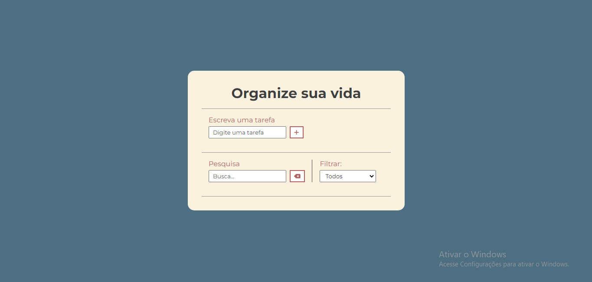

## Projeto Todo-List ✔

Projeto feito para estudo de DOM, Métodos de array, LocalStorage, eventos...

Projeto não contém responsividade, pois foi criado apenas para melhorar o conhecimento em javascript.

### Tecnologias 🚀

- HTML
- SASS
- JAVASCRIPT
- CSS

### Design 🎨

### Acesse o projeto pelo link abaixo

<a href="">Acesse o projeto</a>